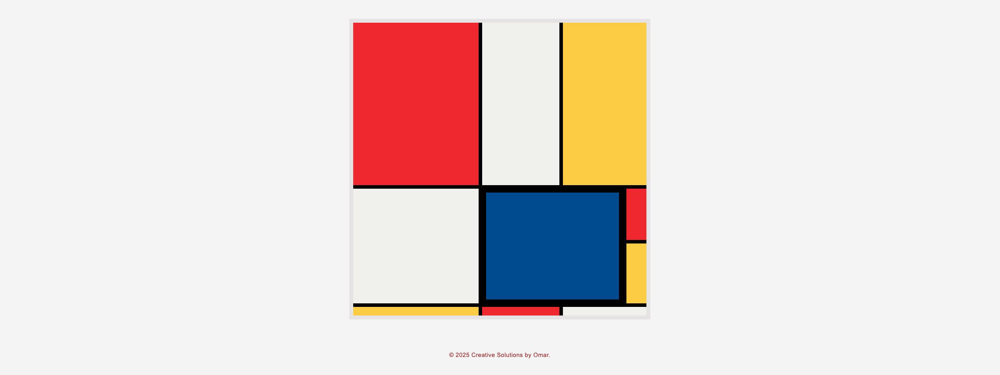

# 🎨 Mondrian Painting with CSS Grid

A modern recreation of **Piet Mondrian’s abstract painting** — built entirely using **HTML5** and **CSS Grid**.  
This project demonstrates how to use CSS Grid for layout precision, color balance, and responsive design while keeping semantic HTML structure.

---

## 📸 Live Demo

[View on GitHub Pages](https://alzubi-omar.github.io/mondrian-painting/)


---

## 🖼️ Preview



---

## 📂 Project Structure

```

mondrian-painting/
│
├── index.html
├── css/
│   └── styles.css
├── js/
│   └── script.js
├── img/
│   └── screenshot.png
└── README.md

````

---

## 🧱 Technologies Used

- **HTML5** – semantic and accessible structure  
- **CSS3 Grid Layout** – for precise grid positioning  
- **JavaScript** – for dynamic footer year and future enhancements  

---

## 💻 How to View Locally

1. **Clone or download** the repository:
   ```bash
   git clone https://github.com/alzubi-omar/mondrian-painting.git
   cd mondrian-painting
````

2. Open the index.html file directly in your web browser.

That’s it! 🎉 You’ll see a Mondrian-inspired grid painting appear on the screen.

---

## 🧩 Accessibility

* `role="img"` and `aria-label` provide descriptive alt-text for the grid artwork
* Hidden `<h1>` ensures screen readers can identify the project title
* All colors use strong contrast against the black grid borders

---

## 🪄 Future Enhancements

* Add hover effects to highlight each color block
* Animate grid transitions
* Generate random Mondrian-style layouts with JavaScript
* Add a “Download as PNG” button for users

---

## 📄 License

This project is open source under the **MIT License** —
you’re free to use, modify, and share it for personal or educational purposes.

---

## 👨‍🎨 Author

**Omar**
Creative Solutions by Omar
© 2025 Creative Solutions by Omar. All rights reserved.


---
